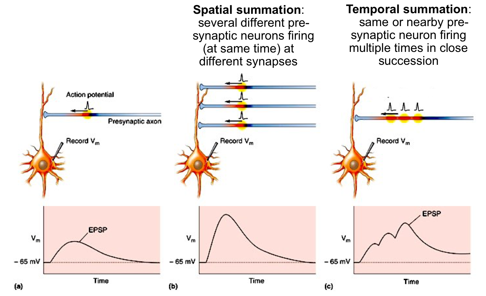

#core/appliedneuroscience

Summation refers to the **process by which neurons integrate input signals.** [Graded potentials](graded_potential.md) arising across the dendrites and cell body are added together to determine whether the neuron will fire an action potential at the [axon initial segment](axon_initial_segment.md). There are two types of summation: spatial and temporal.

## Spatial Summation

Spatial summation is the **addition of simultaneous inputs from different locations** on the dendrites and cell body of the neuron.

- Inputs from multiple presynaptic neurons arrive at the same time, and their graded potentials combine as they spread across the postsynaptic membrane.
- Inputs can be excitatory (depolarising) or inhibitory (hyperpolarising); it is their net effect that matters.
- If this net effect is sufficient to reach the threshold potential, an action potential will be generated.

## Temporal Summation

Temporal summation is the **addition of successive inputs from the same location** over a short period of time, occurring when a single presynaptic neuron fires action potentials in rapid succession.

- Each new graded potential begins before the previous one has fully decayed, so their effects accumulate on top of one another.
- A single presynaptic neuron can thus influence whether the postsynaptic neuron reaches the threshold potential.
- If the combined effect of these successive inputs is sufficient to reach the threshold potential, an action potential will be generated.
