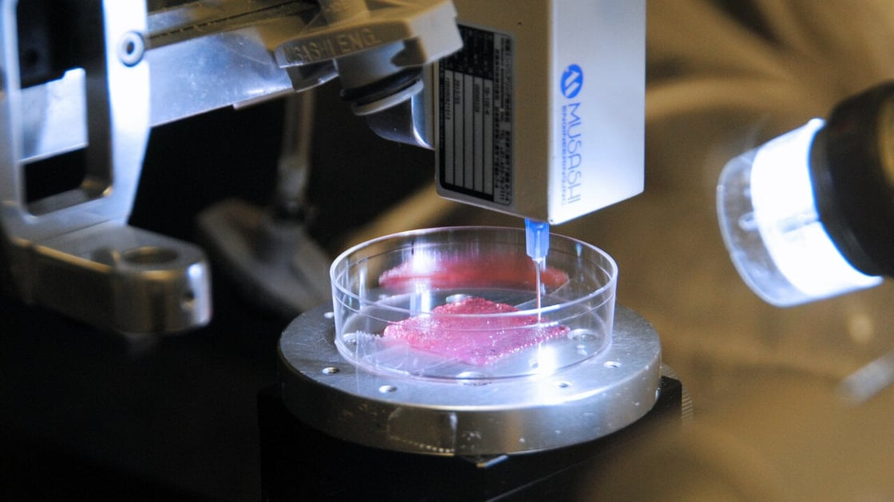

#lead/experimentalmedicine #core/appliedneuroscience

Bioprinting, also known as 3D bioprinting, is a fabrication method that combines **3D printing with biomaterials to construct tissue-like structures.** Tissue-like structure alone does not demonstrate physiological function, therapeutic benefit, or clinical readiness; bioprinting is therefore a tool for experimental work rather than evidence of an effective intervention.

Bioprinting can help create engineered physical microenvironments for biological models, but fabrication is not validation. [Topographic guidance cues](../../../002_profession/eightsix/topographic_guidance_cues.md) are one way to design physical features that shape cellular responses. This differs from [human-on-a-chip systems](../../../001_private/books/neural_tissue_engineering/human-on-a-chip_systems.md), which use controlled microfluidic experimentation to study selected interactions; fabricating a structure and testing a model are related but distinct steps.

## How Bioprinting Works

Bioprinting involves the use of a specialised printer, known as a bioprinter, which utilises biomaterials such as living cells, synthetic glue, and collagen scaffolds to fabricate three-dimensional structures. The process follows these steps:

1. **Digital Model Creation**: A digital model or blueprint of the desired tissue or organ is created using computer-aided design (CAD) software (<https://www.news-medical.net/health/What-is-Bioprinting.aspx>).
2. **Material Selection**: The appropriate biomaterials and bio-inks are chosen based on the specific requirements of the target structure (<https://www.news-medical.net/health/What-is-Bioprinting.aspx>).
3. **Bioprinting**: The selected bio-inks may contain living cells and are loaded into the bioprinter’s cartridges. The bioprinter then deposits the bio-inks layer by layer, following the digital model, to create the desired structure (<https://www.news-medical.net/health/What-is-Bioprinting.aspx>).
4. **Post-Bioprinting Processing**: After bioprinting, the printed structure undergoes post-processing steps to enhance its stability and promote cell growth. This may involve mechanical and chemical stimulation (<https://www.news-medical.net/health/What-is-Bioprinting.aspx>).
