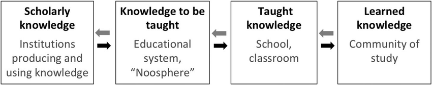

#fundamental/communication

Didactic transposition is Yves Chevallard's name for the **deformation of knowledge as it moves from the scholars who produce it to the classroom where it is taught.** The taught version is not a simpler copy of the scholarly one. It is a different object, and the gap is usually denied.

The diagram shows the chain. Chevallard's cut is the first three boxes, in two movements:

- **External transposition**, outside the teaching system. The noosphere — curricula, programmes, and textbooks — selects from scholarly knowledge (*savoir savant*) and designates knowledge to be taught (*savoir à enseigner*).
- **Internal transposition**, inside the teaching system. What is actually taught (*savoir enseigné*) is necessarily other than what was designated to be taught. The lesson is not the syllabus.

The arrows run both ways because the fit is negotiated. Taught knowledge must look close enough to scholarly knowledge to be legitimate, and distant enough from everyday knowledge to justify the school. The fourth box, learned knowledge, is not a third stage he named. It marks a further gap: what a class comes to hold is not what was taught.

> [!example] Relativity
>
> Scholarly knowledge is the theory as physicists use it. External transposition turns a fragment of it into a syllabus line or a textbook chapter. Internal transposition is the lesson, which is not that chapter. A school telling of the twin paradox and a university derivation are different taught objects. Neither is the theory, and what the class retains is not what was said.
