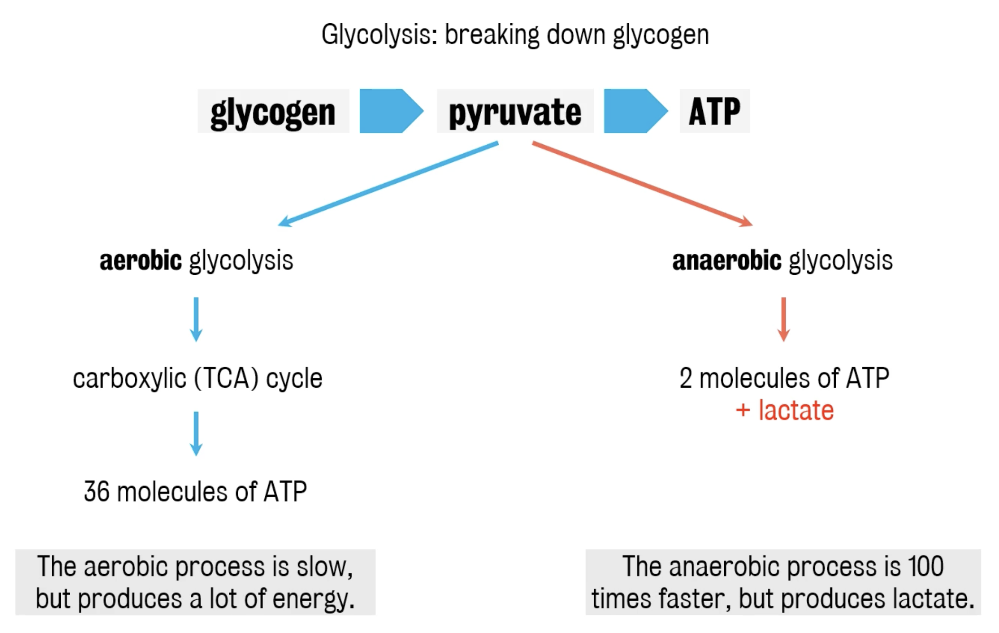

#core/appliedneuroscience

## Introduction

The brain is a highly energy-**demanding organ, relying primarily on glucose metabolism.** Glycolysis is the cytosolic pathway that converts glucose to pyruvate; downstream mitochondrial pyruvate oxidation, the TCA cycle, and oxidative phosphorylation are separate stages of oxidative glucose metabolism.

## Aerobic Glycolysis

- **Definition**: Glycolysis itself does not use oxygen directly. In neuroscience, **aerobic glycolysis** can refer to glycolytic glucose-to-lactate production despite oxygen availability; it is not synonymous with all oxidative glucose metabolism.
- **Location**: Glycolysis takes place in the cytosol. Pyruvate may subsequently enter mitochondria for oxidation, the TCA cycle, and oxidative phosphorylation.
- **Process**:
  - Glucose is converted into pyruvate through a series of enzymatic reactions, yielding a net 2 ATP per glucose.
  - Pyruvate can be converted to lactate or oxidised through downstream mitochondrial pathways, depending on cellular conditions.
- **Role in the Brain**:
  - Lactate production despite oxygen availability is a recognised feature of brain metabolism and can support signalling and biosynthetic demands.

## Anaerobic Glycolysis

- **Definition**: Anaerobic glycolysis refers to glycolysis followed by lactate formation when oxidative metabolism cannot adequately process pyruvate, such as when oxygen is limited.
- **Location**: Glycolysis and lactate formation occur in the cytosol.
- **Process**:
  - Glucose is broken down into pyruvate, which is then converted into lactate when oxygen is limited.
  - The conversion of pyruvate to lactate regenerates NAD+, crucial for continuous glycolysis.
- **Energy Yield**: Glycolysis produces a net 2 ATP molecules per glucose.
- **Role in the Brain**:
  - Occurs during conditions of high energy demand or low oxygen supply.
  - Lactate produced can be utilised as an energy source by neurons.
