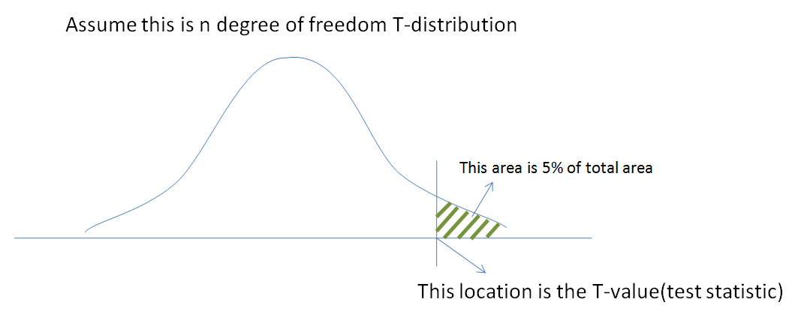

#core/appliedneuroscience #core/artificialintelligence

The **t-value** is a standardised test statistic in hypothesis testing. It expresses an estimated effect’s distance from its null value in standard-error units.

## Definition

The general form is:

$$
t = \frac{\text{estimated effect} - \text{null effect}}{\text{standard error}}
$$

For a one-sample test, the effect is the sample mean and the null effect is the hypothesised population mean. For a paired test, the effect is the mean within-pair difference. Independent two-sample tests use the difference between group means: the pooled version assumes equal variances, whereas Welch’s version does not.

## Key Points

- **Standard error**: The estimated sampling variability of the effect.
- **Degrees of freedom**: Determined by the test and sample sizes; they determine the relevant t-distribution.

## Interpretation

The t-value indicates how many standard errors the estimated effect is from the null effect. Its sign indicates direction; evidence against the null depends on its magnitude relative to the t-distribution with the appropriate degrees of freedom and on whether the test is one- or two-sided.

- **Two-sided tests**: Use $|t|$ when assessing extremeness; a larger positive signed t is not inherently more significant than a negative t of the same magnitude.
- **One-sided tests**: Use the tail specified before examining the data.

## Usage in Hypothesis Testing

In a t-test, the t-value is used to calculate the [P-value](../../../001_private/books/essential_math_for_data_science/p-value.md), which then helps to determine whether to reject the null hypothesis. The steps include:

1. **Calculate the t-value** using the formula.
2. **Compare the calculated t-value** with the appropriate critical region from the t-distribution, based on the degrees of freedom and sidedness.
3. **Determine the [p-value](../../../001_private/books/essential_math_for_data_science/p-value.md)**, which indicates the probability of observing a t-value as extreme as, or more extreme than, the observed value if the null hypothesis is true.

> [!example]
> If you’re testing whether the means of two groups are different, you calculate the t-value. For a two-sided test, an absolute t-value beyond the critical magnitude (from t-distribution tables) indicates a statistically significant difference; a one-sided test uses its pre-specified critical region.

> [!warning]
> It’s essential to understand:
>
> - The t-value itself does not indicate the probability of the null hypothesis being true or false.
> - The interpretation of the t-value depends on the context of the study and the established threshold for significance.
> - Similar to the [p-value](../../../001_private/books/essential_math_for_data_science/p-value.md), the t-value’s significance can be influenced by the sample size.
