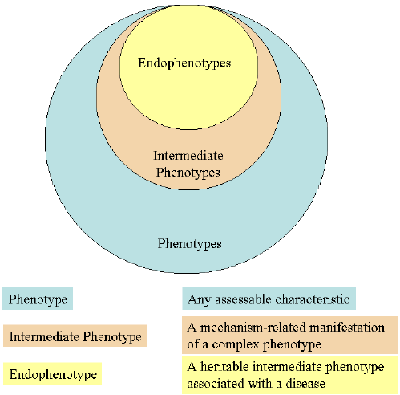

#core/appliedneuroscience

An endophenotype is not a [biomarker](../06_neuroimaging_in_mental_health/biomarker_and_neuromarker.md). A biomarker can mark the current state of an illness. An endophenotype is a **heritable intermediate phenotype**: a measurable trait between genes and the clinical syndrome, present whether or not the illness is active.

Gottesman and Gould (2003) gave the working criteria:

- Associated with the illness in the population.
- Heritable. That is a population statistic, not a claim that the trait is genetic in nature, or that environment is excluded.
- State-independent: present in remission, not only during an episode.
- Co-segregates with the illness within families.
- Found in unaffected relatives more often than in the general population.

Presence in unaffected relatives does not prove a genetic cause. A shared family environment can produce the same pattern. The criterion is a reason to keep looking, not a demonstration.

Specificity to one diagnosis was hoped for, and mostly failed. Working-memory impairment and sensory-gating measures cut across schizophrenia, bipolar disorder, and ADHD. The useful claim is not that the trait names one disease. It is that the trait is closer to a mechanism than the syndrome is.

A cognitive deficit, an EEG pattern, or an anatomical measure is a candidate endophenotype only if it meets the criteria above. A neurotransmitter level that rises in an episode and falls in remission is a state marker, not an endophenotype.
