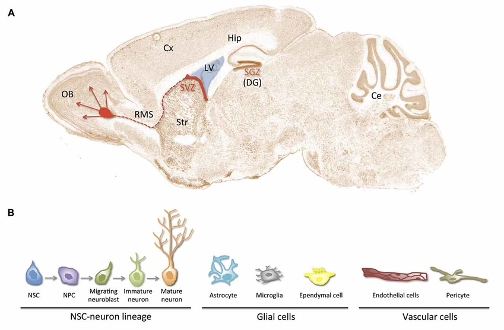

#core/appliedneuroscience

The neurogenic niche refers to **a local cellular and molecular microenvironment that can support neural stem or progenitor-cell maintenance, proliferation, differentiation, and survival.** It is not evidence that a region produces substantial numbers of mature neurons throughout life, particularly in humans.

## Definition of Neurogenic Niche

- **Neurogenic niches**: Anatomical locations and their local cellular and molecular environments where neurogenic activity can occur. Astrocytes, endothelial and perivascular cells, microglia, extracellular matrix, blood supply, and local signals can influence progenitor behaviour. The presence of a marker or progenitor population does not by itself establish mature neuronal integration or repair.

## Key Locations

- **Adult rodent subventricular zone (SVZ)**: Located along the lateral ventricles, this niche supports well-established progenitor activity. In rodents, some cells migrate through the rostral migratory stream towards the olfactory bulb; this pathway is not established as an equivalent adult human process.
- **Adult rodent hippocampal dentate gyrus (DG-SGZ)**: This is another well-established site of adult rodent neurogenesis. Rates, survival, maturation, and circuit integration vary with species, age, and context.
- **Adult human hippocampal DG**: Dumitru et al. (2025) identified rare, highly variable proliferating neural progenitor signatures. Their magnitude and functional significance remain unresolved. Adult human SVZ-to-olfactory-bulb neurogenesis is unestablished; see [neurogenesis](../04_biological_foundations_of_mental_health/neurogenesis.md) for the evidence controversy and source context.

## Functions of Neurogenic Niches

- **Brain plasticity**: In animal models, niche signals can influence adaptation and the survival or maturation of new cells.
- **Cognitive function**: Adult rodent DG neurogenesis has been studied in relation to learning and memory, but this does not establish a corresponding human mechanism or functional contribution.
- **Response to injury**: Injury can change niche signals and experimental plasticity. This is not the same as demonstrated endogenous human brain repair or reliable replacement of damaged neurons.

## Application in Neuroscience

- **Research and therapy**: Studying niches may clarify mechanisms relevant to neurological disease and injury, but therapeutic translation remains experimental.
- **Regenerative medicine**: Enhancing or mimicking niche conditions is an experimental strategy; it should not be presented as demonstrated effective human repair.

## Sources

- Dumitru et al. (2025), “Identification of proliferating neural progenitors in the adult human hippocampus,” *Science* 389:58–63. [https://doi.org/10.1126/science.adu9575](https://doi.org/10.1126/science.adu9575)
- Sorrells et al. (2018), “Human hippocampal neurogenesis drops sharply in children to undetectable levels in adults,” *Nature* 555:377–381. [https://doi.org/10.1038/nature25975](https://doi.org/10.1038/nature25975)
- Boldrini et al. (2018), “Human Hippocampal Neurogenesis Persists throughout Aging,” *Cell Stem Cell* 22:589–599.e5. [https://doi.org/10.1016/j.stem.2018.03.015](https://doi.org/10.1016/j.stem.2018.03.015)
