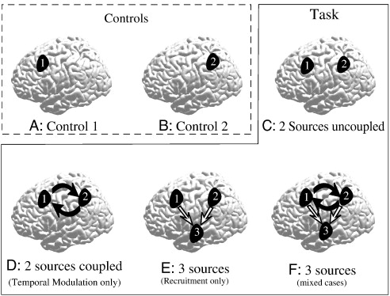

#core/appliedneuroscience

By **comparing brain activity in one condition to another** (such as when a person is performing a task versus when they are at rest), researchers can **identify which areas of the brain are involved in specific cognitive processes**. This is known as the principle of cognitive subtraction.
