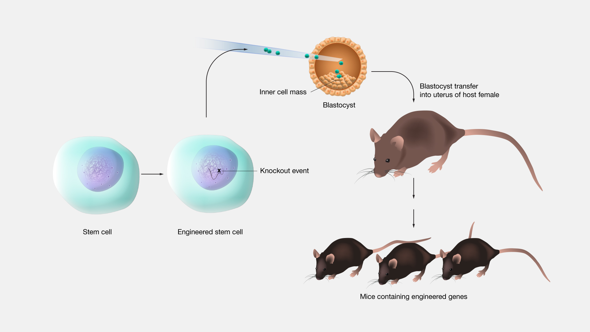

#core/appliedneuroscience

A genetic knockout allows researchers to **study the function of specific genes by observing what happens when they are disabled.** Common methods include homologous recombination and CRISPR-Cas9. In neuroscience, knockouts help identify genes involved in brain development and neurological disorders. Limitations include possible compensatory effects and lethality if essential genes are removed. Conditional knockouts can target specific tissues or developmental stages.
