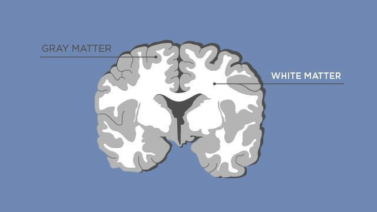

#core/appliedneuroscience

**Grey matter processes information in the brain**, while **white matter serves as a communication network** between different regions of grey matter. Both are important for cognitive and physical functioning and work together to facilitate neural communication and support overall brain function.

## Grey Matter

Grey matter contains **neuronal cell bodies, dendrites, and unmyelinated axons**. It is found in the cortex (outer layer of the brain), deep nuclei (e.g., basal ganglia), and spinal cord. Grey matter is where synaptic processing occurs—receiving inputs, integrating signals, and generating outputs. See [Neuronal cell types](Neuronal%20cell%20types.md) for the diversity of cells involved.

## White Matter

White matter consists of **myelinated axon bundles** (tracts) that connect grey matter regions. The myelin sheath (produced by oligodendrocytes in the CNS) enables rapid signal transmission. [Cortical connections](../04%20Biological%20Foundations%20of%20Mental%20Health/Cortical%20connections.md) describes how these tracts link cortical areas. [Diffusion tensor tractography](../04%20Biological%20Foundations%20of%20Mental%20Health/Diffusion%20tensor%20tractography.md) is an imaging technique that visualises white matter pathways in vivo.

## Clinical Relevance

White matter lesions are associated with multiple sclerosis and age-related cognitive decline. Grey matter atrophy is observed in neurodegenerative diseases like Alzheimer's.
