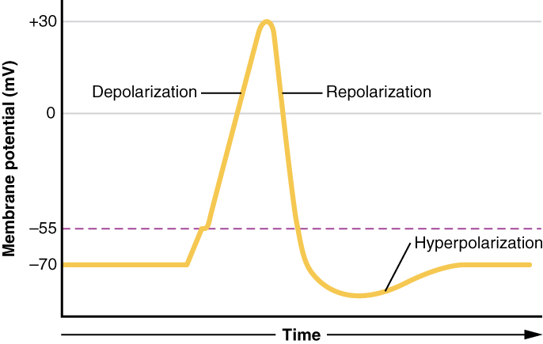

#core/appliedneuroscience

## Hyperpolarisation

- Decrease in voltage, resulting in a more negative [Resting membrane potential](Resting%20membrane%20potential.md)
- Decreases the likelihood of firing an action potential
- Can be caused by the opening of potassium channels or the activation of inhibitory neurotransmitter receptors

## Depolarisation

- Increase in voltage, resulting in a more positive [Resting membrane potential](Resting%20membrane%20potential.md)
- Increases the likelihood of firing an action potential
- Can be caused by the opening of sodium channels or the activation of excitatory neurotransmitter receptors
- Regulates the activity of neurons and controls the flow of information in the nervous system.
