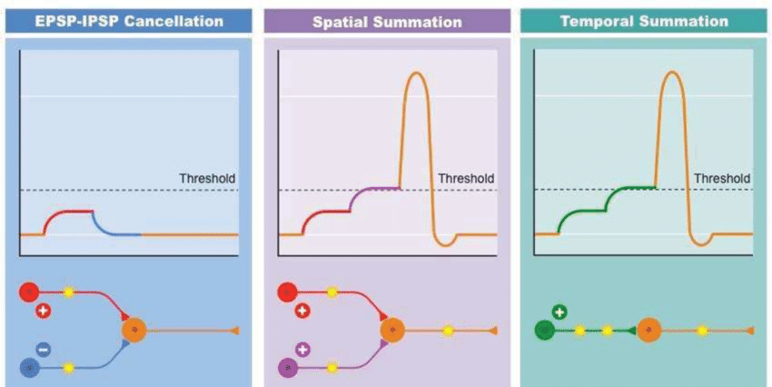
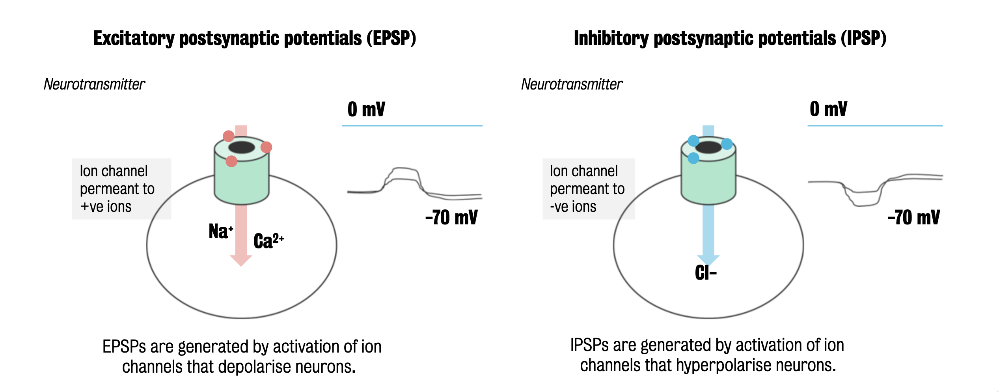

#core/appliedneuroscience

**Neuronal potentials can be excitatory or inhibitory,** leading to the concepts of Excitatory [Post-Synaptic](../04%20Biological%20Foundations%20of%20Mental%20Health/Pre-%20and%20post-synaptic.md) Potentials (EPSPs) and Inhibitory Post-Synaptic Potentials (IPSPs).

## Excitatory [Post-Synaptic](../04%20Biological%20Foundations%20of%20Mental%20Health/Pre-%20and%20post-synaptic.md) Potentials (EPSPs)

EPSPs are graded **potentials that can initiate an action potential if they are strong enough.**

- EPSPs occur when a neurotransmitter binds to a receptor that stimulates the opening of [ion channels](Ion%20channels.md), allowing positive ions to flow into the neuron. This makes the neuron more positive, moving it closer to the threshold for firing an action potential.
- EPSPs are typically caused by the influx of sodium (Na+) ions but can also be caused by the efflux of negatively charged chloride (Cl-) ions.
- They are considered “excitatory” because they increase the likelihood that the neuron will fire an action potential.

## Inhibitory [Post-Synaptic](../04%20Biological%20Foundations%20of%20Mental%20Health/Pre-%20and%20post-synaptic.md) Potentials (IPSPs)

IPSPs are graded **potentials that decrease the likelihood of an action potential.**

- IPSPs occur when a neurotransmitter binds to a receptor that stimulates the opening of [ion channels](Ion%20channels.md), allowing negative ions to flow into the neuron or positive ions to flow out of the neuron. This makes the neuron more negative, moving it further from the threshold for firing an action potential.
- IPSPs are typically caused by the influx of chloride (Cl-) ions or the efflux of potassium (K+) ions.
- They are considered “inhibitory” because they decrease the likelihood that the neuron will fire an action potential.

The sum of EPSPs and IPSPs at any given moment influences whether an action potential will be initiated. If the sum of EPSPs and IPSPs reaches the threshold for triggering an action potential, the neuron will fire.
