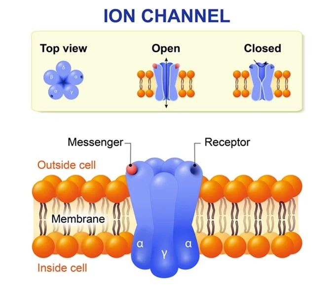

#core/appliedneuroscience

Ion channels are **pore-forming proteins present in the neuronal membrane that allow the passage of specific ions**, such as sodium (Na^+), potassium (K^+), calcium (Ca^{2+}), or chloride (Cl^-), across the membrane. They are **crucial for generating and transmitting electrical signals in neurons.** These channels can be gated, meaning they open or close in response to specific stimuli like changes in membrane potential (voltage-gated), binding of a neurotransmitter (ligand-gated), or mechanical [stress](../03%20Mental%20Health%20in%20the%20Community/Stress.md).

- Proteins that regulate the flow of ions in/out of cells.
- Essential for the electrical activity of neurons.
- Single-channel recording: Studies properties of individual ion channels. High resolution.
