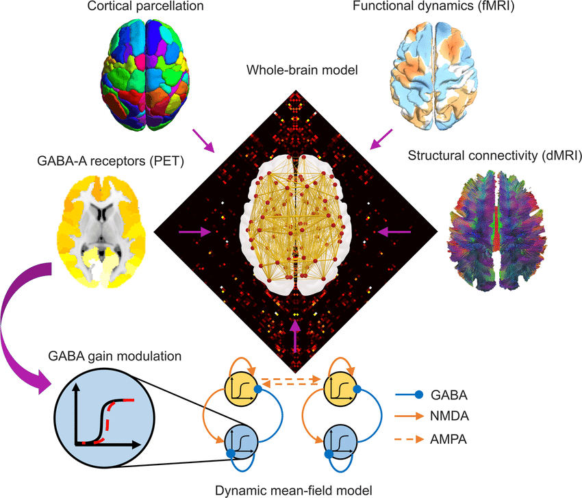

#core/appliedneuroscience

Multimodal imaging in e.g. fMRI uses multiple techniques, like fMRI and sMRI, to study both brain function and structure for a more complete understanding.

## Overview

**Multi-modal imaging** refers to the integration of two or more imaging techniques to acquire complementary information about the brain. Common combinations include:

- **fMRI (functional MRI)**: Measures brain activity by detecting changes in blood flow.
- **sMRI (structural MRI)**: Provides detailed images of brain anatomy.
- **PET (Positron Emission Tomography)**: Assesses metabolic processes.
- **EEG (Electroencephalography)** and **MEG (Magnetoencephalography)**: Record electrical and magnetic activity, offering high temporal resolution.

## Advantages

- **Comprehensive Insight:** Combining modalities allows researchers to correlate structural, functional, and metabolic data, improving understanding of underlying neural mechanisms.
- **Improved Diagnosis:** Multi-modal imaging is valuable for diagnosing neurological disorders, such as epilepsy, Alzheimer’s disease, and brain tumours, by providing a multi-faceted view.
- **Enhanced Localisation:** Simultaneous acquisition (e.g. EEG-fMRI) enables precise localisation of brain activity in both space and time.

## Applications

- **Neuroscience Research:** Investigating how structural changes relate to functional alterations in conditions like multiple sclerosis or following a stroke.
- **Clinical Practice:** Guiding surgical planning (e.g. epilepsy surgery) and monitoring treatment effects.
- **Brain Mapping:** Creating detailed atlases of brain function and connectivity.

## Challenges

- **Technical Complexity:** Requires sophisticated data acquisition, alignment, and analysis techniques.
- **Cost and Accessibility:** Multi-modal systems can be expensive and are less widely available than single-modality options.
