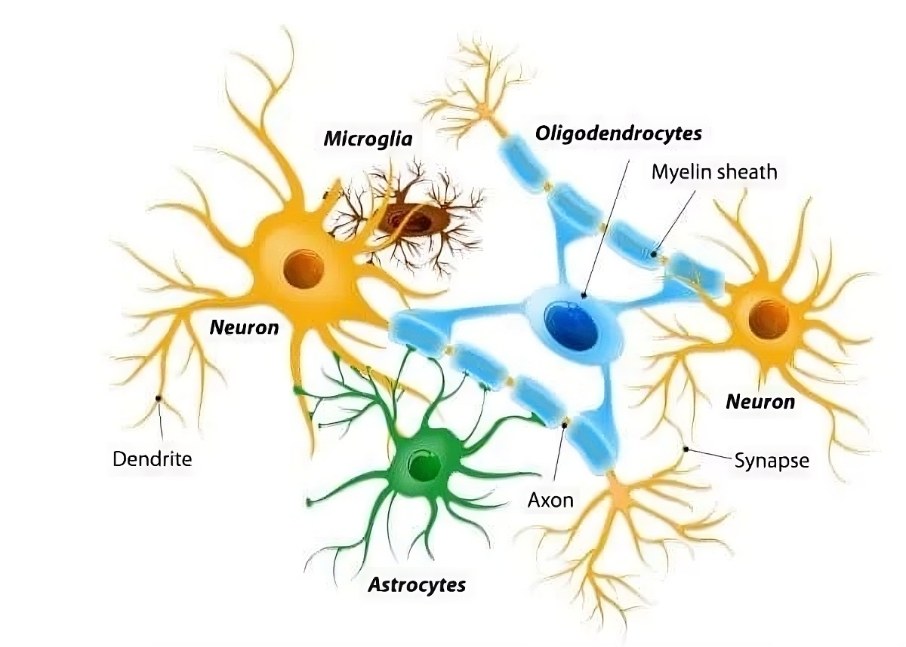

#core/appliedneuroscience

- **Neurons:** the primary cells responsible for transmitting information in the brain
- **Glial cells:** cells that provide support and protection for neurons
	- **Astrocytes:** a type of glial cell involved in the regulation of neurotransmitters and the maintenance of the [blood-brain barrier](../06%20Neuroimaging%20in%20Mental%20Health/Blood-brain%20barrier.md)
	- **Microglia:** the immune cells of the brain, responsible for defending against disease and injury
- **Oligodendrocytes:** cells that produce myelin, a fatty substance that insulates nerve fibres and helps to speed up the transmission of signals in the brain
- **Ependymal cells:** cells that line the fluid-filled spaces in the brain, playing a role in cerebrospinal fluid circulation.
