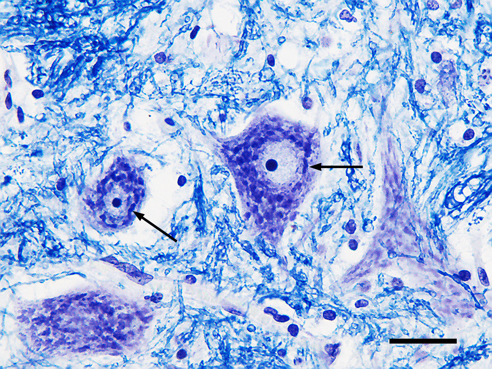

#core/appliedneuroscience

Nissl staining: A histological staining technique used to visualise the distribution of cell bodies and nuclei in the brain and spinal cord.

## Purpose

- To study the anatomy and distribution of neurons in the [central nervous system](../04%20Biological%20Foundations%20of%20Mental%20Health/Central%20nervous%20system.md).
- To evaluate the integrity of neuronal cell bodies in neurological disorders.

## Method

- Tissue is fixed and stained with a basic dye (e.g. thionin).
- The dye binds to the rough endoplasmic reticulum (Nissl bodies) in the cytoplasm of neurons, allowing for visualisation under a microscope.

## Result

- A stained image that highlights the distribution of neuronal cell bodies and nuclei in the tissue.
- It can be used to evaluate the effects of neurological disorders on neuronal populations.
