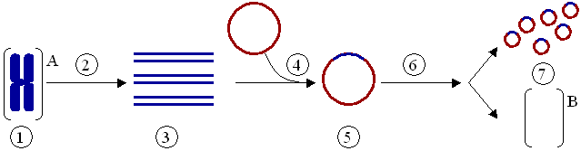

#core/appliedneuroscience

- Polymerase Chain Reaction (PCR) **amplifies or copies specific DNA sequences in vitro.**
- PCR is often used to amplify a specific gene of interest in cloning cells.
- The amplified DNA can then be cloned into a vector, such as a plasmid, and transformed into host cells for further manipulation and expression.
