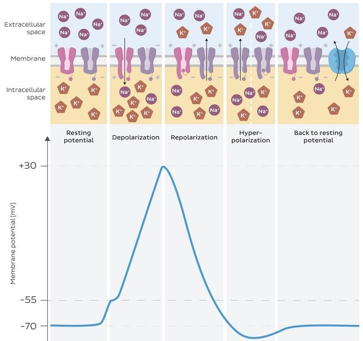

#core/appliedneuroscience

The resting membrane potential refers to the **voltage difference across a neuron's membrane when it is inactive and not transmitting a signal.** The neuron's interior is typically around 70 millivolts lower in voltage than the exterior, resulting in a resting membrane potential of -70 millivolts.

## Ion Concentration Gradients

The resting potential arises from unequal distribution of ions across the membrane (see [Concentration gradients](Concentration%20gradients.md)):
- **K+**: High inside (~140 mM), low outside (~5 mM)
- **Na+**: Low inside (~15 mM), high outside (~145 mM)
- **Cl-**: Low inside (~10 mM), high outside (~110 mM)

## Na+/K+-ATPase Pump

This active transport protein maintains ionic gradients by pumping **3 Na+ out** and **2 K+ in** per ATP hydrolysed, creating a net negative charge inside the cell.

## Leak Channels

[Leak channels](../04%20Biological%20Foundations%20of%20Mental%20Health/Leak%20channels.md) allow passive ion flow down concentration gradients. At rest, the membrane is ~40× more permeable to K+ than Na+ via [Ion channels](Ion%20channels.md), so K+ efflux dominates, making the interior negative. Changes from resting state lead to [Hyperpolarisation and depolarisation](Hyperpolarisation%20and%20depolarisation.md).

## Electrical Signaling Pathway

The resting membrane potential is the foundation of neural electrical signaling:

1. **[Ion channels](Ion%20channels.md)** → Selective permeability establishes ionic gradients
2. **Resting potential** (-70mV) → Baseline state maintained by Na+/K+-ATPase and leak channels
3. **[Graded potential](../04%20Biological%20Foundations%20of%20Mental%20Health/Graded%20potential.md)** → Local, proportional changes from synaptic inputs ([IPSPs and EPSPs](IPSPs%20and%20EPSPs.md))
4. **Action potential** → All-or-none signal when threshold reached (see [Types of biological electrical activity](Types%20of%20biological%20electrical%20activity.md))
5. **[Field potential](Field%20potential.md)** → Summed activity of neuronal populations detectable extracellularly
