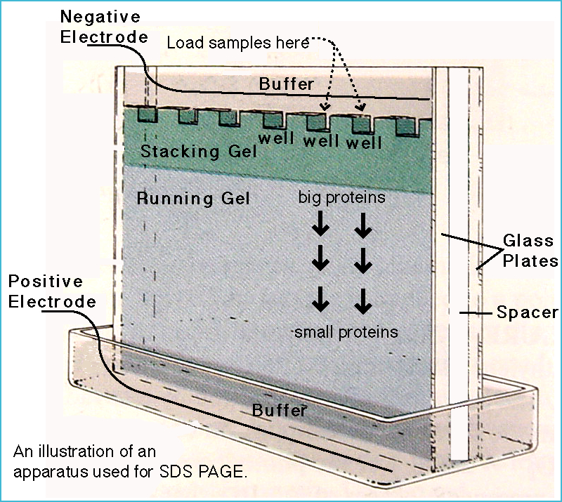

#core/appliedneuroscience

Sodium Dodecyl Sulfate Polyacrylamide Gel Electrophoresis **separates proteins into different sizes using gel & electricity.** Scientists study proteins to understand their size, structure & how they work in our bodies. A valuable tool in biochemistry research.

## Uses

- Determining protein purity
- Estimating molecular weight of proteins
- Analysing protein expression in different samples
- Preparing proteins for further analysis, such as [Western blotting](Western%20blotting.md)

## Typical Workflow

- Sample preparation: Proteins are mixed with SDS and a reducing agent, then boiled to ensure complete denaturation.
- Loading and running: Samples are loaded into wells in the gel and subjected to electrophoresis.
- Staining: Gels are stained (e.g., with Coomassie Blue or silver stain) to visualise protein bands.
- Analysis: The pattern of bands is compared with molecular weight markers for identification.
