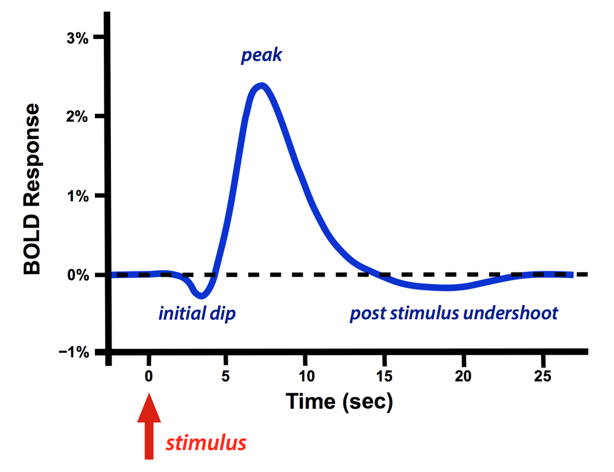

#core/appliedneuroscience

The **blood-oxygen-level dependent (BOLD) signal** is the basis of fMRI neuroimaging. It measures neural activity indirectly by detecting changes in blood oxygenation associated with neuronal firing.

## Physiological Basis

The BOLD signal exploits the different magnetic properties of oxygenated and deoxygenated haemoglobin:

- **Oxyhaemoglobin** is diamagnetic — it has minimal effect on the local magnetic field
- **Deoxyhaemoglobin** is paramagnetic — it distorts the surrounding magnetic field, causing signal loss in MRI

When neurons fire, local oxygen consumption initially increases, but [Neurovascular coupling](../06%20Neuroimaging%20in%20Mental%20Health/Neurovascular%20coupling.md) triggers a much larger increase in [Cerebral blood flow](../06%20Neuroimaging%20in%20Mental%20Health/Cerebral%20blood%20flow.md). This over-compensatory blood flow *floods* the active region with oxygenated blood, washing out deoxyhaemoglobin and producing a net increase in the MRI signal. It is this haemodynamic over-compensation — not the neural activity itself — that fMRI detects.

## The Haemodynamic Response Function

The BOLD signal follows a characteristic time course known as the **haemodynamic response function (HRF)**:

| Phase | Timing | Description |
|-------|--------|-------------|
| Initial dip | ~0–2 s | Brief signal decrease as local oxygen is consumed before blood flow increases |
| Rise to peak | ~2–6 s | CBF over-compensation delivers excess oxyhaemoglobin |
| Peak | ~5–8 s | Maximum BOLD contrast (~1–5% signal change) |
| Post-stimulus undershoot | ~10–25 s | Signal falls below baseline, possibly due to prolonged blood volume increase after flow normalises |

This sluggish response means the BOLD signal is a temporally smoothed version of underlying neural events, fundamentally limiting the temporal resolution of fMRI to the order of seconds.

## Limitations

- **Indirect measure** — BOLD reflects vascular changes, not electrical activity directly. This makes it sensitive to anything that affects blood flow, not just neural firing
- **Low temporal resolution** — the HRF peaks ~6 s after neural activity, compared to millisecond precision in [EEG](../06%20Neuroimaging%20in%20Mental%20Health/Dipoles%20in%20EEG.md). See [Comparison of neuroimaging methods](Comparison%20of%20neuroimaging%20methods.md)
- **Susceptibility artefacts** — signal dropout near air-tissue interfaces (sinuses, ear canals) can obscure regions of interest. See [fMRI image quality](fMRI%20image%20quality.md)
- **Assumption of linearity** — the HRF is often assumed to sum linearly for closely spaced stimuli, but this does not always hold
- **[Double-dipping](../06%20Neuroimaging%20in%20Mental%20Health/Double-dipping.md)** — statistical pitfalls arise when the same BOLD data are used for both selection and analysis

## Relation to Other Concepts

- [Neurovascular coupling](../06%20Neuroimaging%20in%20Mental%20Health/Neurovascular%20coupling.md) — the mechanism that links neural activity to the blood flow changes BOLD detects
- [Cerebral blood flow](../06%20Neuroimaging%20in%20Mental%20Health/Cerebral%20blood%20flow.md) — what is being modulated in the BOLD response
- [Initial dip in BOLD signal](Initial%20dip%20in%20BOLD%20signal.md) — the early transient before the main HRF peak
- [fMRI image quality](fMRI%20image%20quality.md) — spatial resolution, SNR, and artefacts affecting BOLD measurement
- [Cognitive subtraction](Cognitive%20subtraction.md) — experimental design principle for isolating BOLD signal changes
- [Dipoles in EEG](../06%20Neuroimaging%20in%20Mental%20Health/Dipoles%20in%20EEG.md) — contrasting electrical vs haemodynamic measures of brain activity
