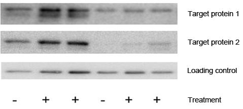

#core/appliedneuroscience

Western blotting is a laboratory **technique used to detect specific proteins in a mixture of many proteins.** It’s a widely used method for analysing proteins, especially in the fields of molecular biology, biochemistry, and immunology.
