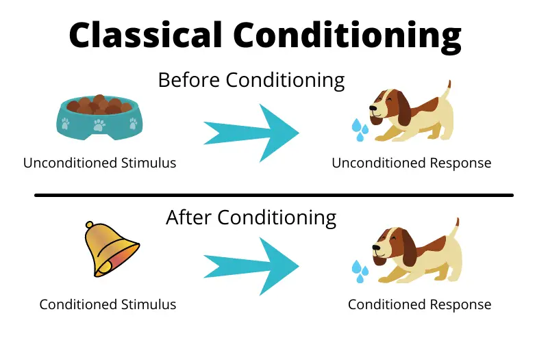

#core/appliedneuroscience

Classical conditioning is a **type of learning that occurs when a neutral stimulus becomes associated with a meaningful stimulus**, resulting in a change in behaviour. Russian psychologist Ivan Pavlov first studied it in the late 19th century.

> [!example]+ Example of Classical Conditioning  
> Imagine a dog that naturally salivates when it sees food. In Pavlov’s experiments, a bell (neutral stimulus) was rung just before the dog received food (unconditioned stimulus). After several pairings, the dog began to salivate (conditioned response) just upon hearing the bell—even if no food appeared.  
> 
> - **Neutral stimulus (NS):** Bell  
> - **Unconditioned stimulus (US):** Food  
> - **Unconditioned response (UR):** Salivation (to food)  
> - **Conditioned stimulus (CS):** Bell (after pairing)  
> - **Conditioned response (CR):** Salivation (to bell)
