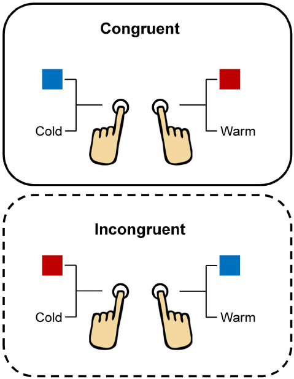

#core/appliedneuroscience 

In cognitive neuroscience and psychology, congruent and incongruent stimuli are often used in experiments to understand attention, perception, and cognitive processing.

## Congruent [Stimuli](Neutral%20vs%20natural%20stimuli.md)

These are stimuli where different aspects align or match. For instance, in the Stroop task, a common cognitive psychology test, a congruent stimulus might be the word “red” printed in red ink.

## Incongruent [Stimuli](Neutral%20vs%20natural%20stimuli.md)

Incongruent stimuli, on the other hand, involve a mismatch or conflict between different aspects. In the Stroop task, an incongruent stimulus might be the word “red” printed in green ink.

---

**Use in Research:**
These concepts are used to study cognitive control and conflict resolution. Typically, responses to incongruent stimuli take longer and are more error-prone, reflecting the cognitive control required to manage the conflict.

**Real-World Application:**
Understanding the cognitive processes behind handling congruent and incongruent stimuli can provide insights into various mental disorders, such as ADHD and schizophrenia, which involve impaired cognitive control.
