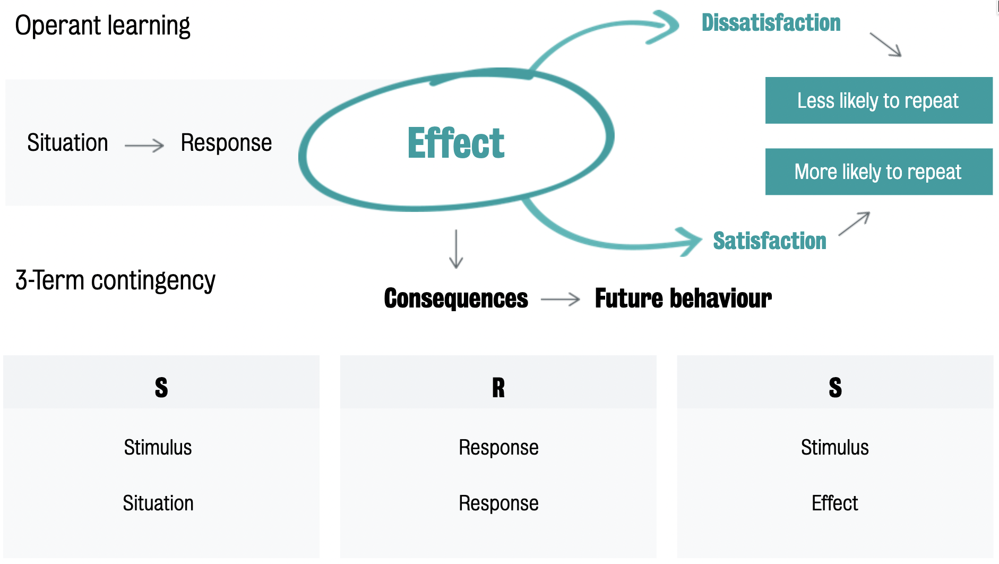

#core/appliedneuroscience

Operant learning, also known as operant conditioning, is a type of learning in which an **individual’s behaviour is modified through the consequences** (rewards or punishments) that follow it. This type of learning was first described by psychologist [B.F. Skinner](https://en.wikipedia.org/wiki/B._F._Skinner) and is based on the idea that behaviours can be strengthened or weakened based on the outcomes that follow them.
