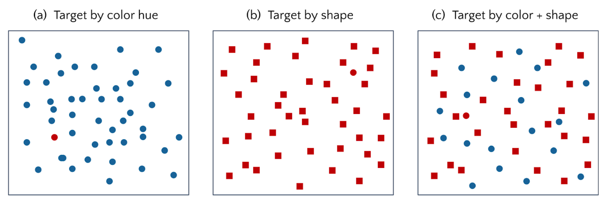

#core/appliedneuroscience 

The “pop-out” effect, a concept from the field of visual perception and cognitive psychology, refers to the phenomenon **where an object stands out from its surroundings due to a distinct feature,** leading to its immediate and effortless recognition.

## Key Features

1. **Efficiency:** The pop-out effect enables quick detection of targets in [visual search](Visual%20search.md) tasks, regardless of the number of distractors.
2. **Feature Singularity:** It’s driven by a unique feature of an object, such as colour, shape, or motion, that differentiates it from its surroundings.

**Usage in Research:**
The pop-out effect is used in studying various topics, like attention and visual perception. It helps us understand how humans process complex visual scenes and prioritise information.

**Real-World Application:**
Examples of the pop-out effect can be found in daily life, such as a red apple among green ones or a flashing emergency light in traffic.
