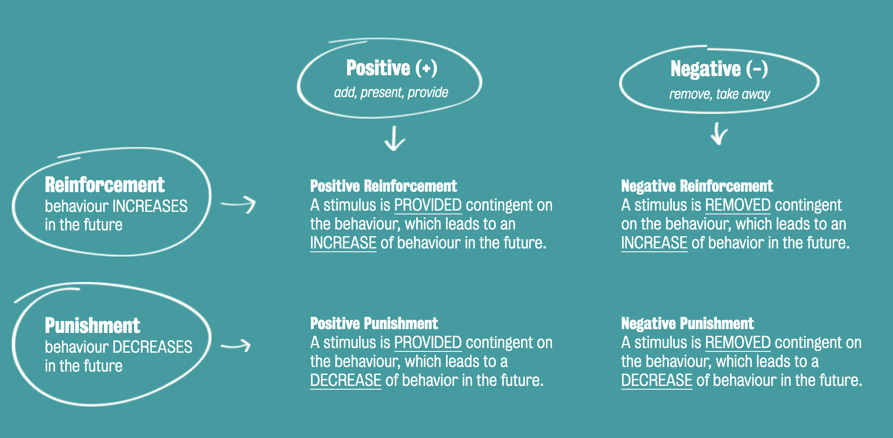

#core/appliedneuroscience

- Reinforcement is a concept in psychology that refers to the **process of increasing the likelihood of a behaviour occurring again in the future.**
- Reinforcers are the stimuli that are used to reinforce behaviour. There are two types of reinforcement: positive and negative.

Positive reinforcement involves adding a pleasant stimulus to increase the likelihood of a behaviour occurring again. In contrast, negative reinforcement involves removing an unpleasant stimulus to increase the likelihood of a behaviour occurring again. Understanding reinforcement and reinforcers is essential in the study of behaviour and can be applied in various settings, such as education and therapy.
