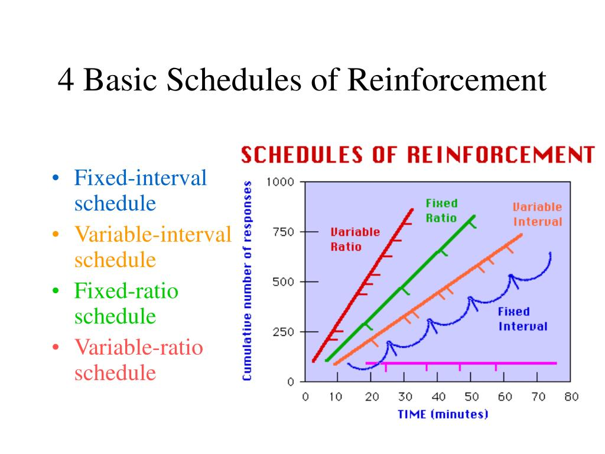

#core/appliedneuroscience

- **Continuous reinforcement:** reinforces behaviour every time it occurs
- **Fixed ratio:** reinforces behaviour after a set number of occurrences
- **Variable ratio:** reinforces behaviour after an unpredictable number of occurrences
- **Fixed interval:** reinforces behaviour after a set amount of time has elapsed
- **Variable interval:** reinforces behaviour after an unpredictable amount of time has elapsed
