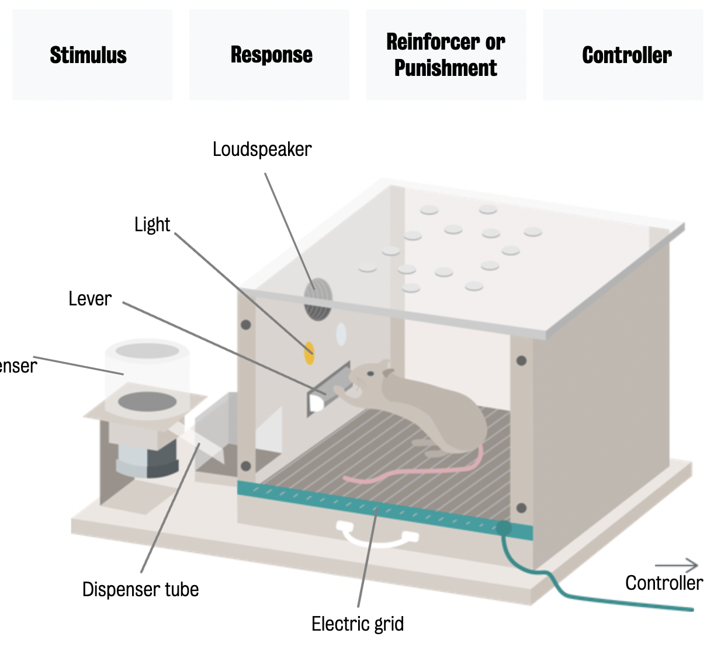

#core/appliedneuroscience

The Operant Chamber, also known as the Skinner Box, was created by the behavioural psychologist B.F. Skinner to study animal behaviour. It typically consists of a small enclosure with a lever or button that an animal can press to receive a reward such as food or water. The box is designed to allow researchers to systematically vary the conditions under which the animal receives the reward and to observe how the animal’s behaviour changes in response to these conditions.
