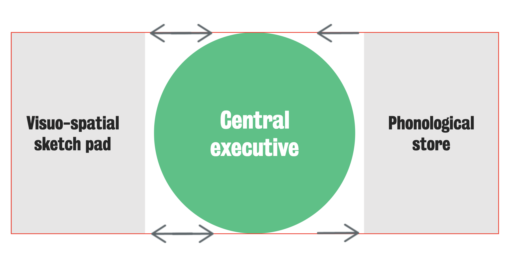

#core/appliedneuroscience

The **working memory model**, proposed by Baddeley and Hitch in 1974, describes short-term memory as comprising three components: the central executive, the phonological loop, and the visuospatial sketchpad.

The **central executive** controls and coordinates the other two components. The **phonological loop** stores and rehearses verbal information, while the **visuospatial sketchpad** stores and manipulates visual information.
