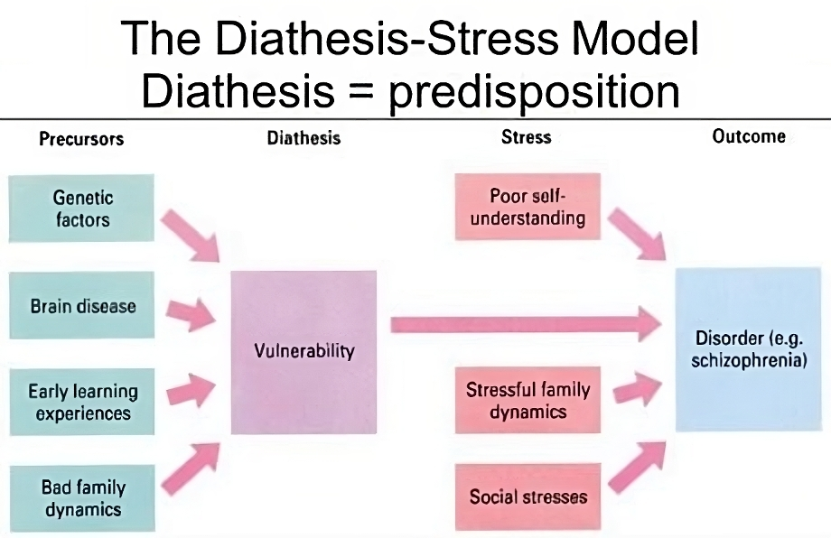

#core/appliedneuroscience

The Diathesis-[Stress](Stress.md) Model is a psychological theory that suggests that **mental disorders arise from the interaction between a person's [predisposition](../../../001_private/_%20general%20knowledge/Predisposition.md) or vulnerability (diathesis) and stressful life events ([stress](Stress.md)).** The model proposes that individuals with a higher diathesis require less [stress](Stress.md) to trigger a disorder, while those with a lower diathesis require more [stress](Stress.md). It is commonly used to explain the development of disorders such as depression, anxiety, and schizophrenia.
