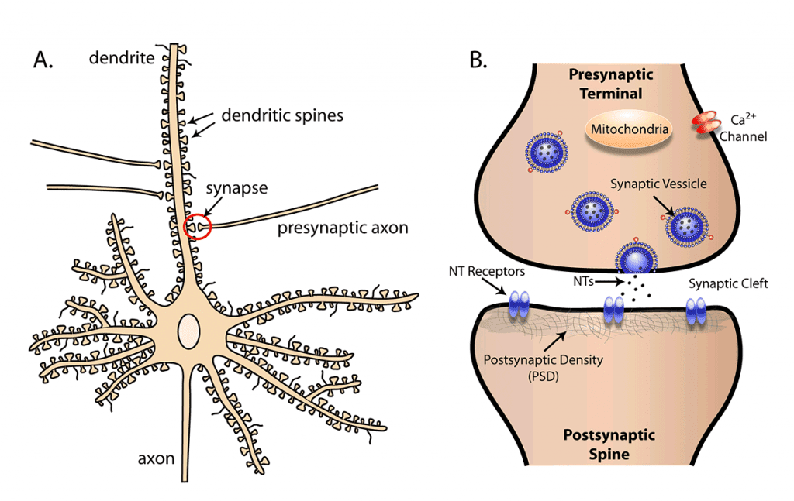
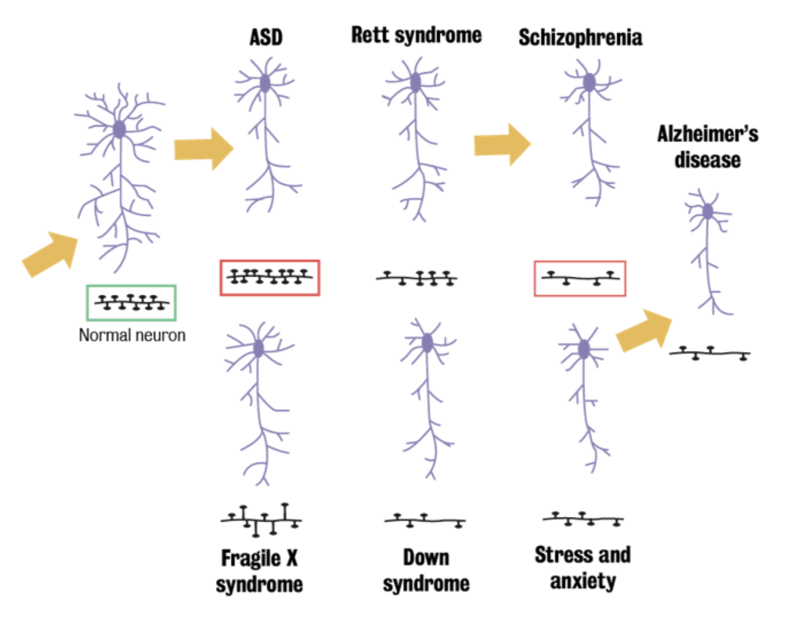

#core/appliedneuroscience

Dendritic spines are **small protrusions that come out of a neuron’s dendrite.** These structures play an important role in the transmission of electrical signals to a neuron’s cell body. Dendritic spines are key components for [synaptic plasticity](Synaptic%20plasticity.md), which is the ability of synapses to strengthen or weaken over time in response to increases or decreases in their activity.

## Structure

Dendritic spines have a bulbous head (the ‘spine head’) and a thin neck. The head typically contains the postsynaptic density, an area dense with receptors and other proteins needed for synaptic transmission. Conversely, the neck serves as a connection between the spine head and the dendrite shaft, potentially compartmentalising electrical signals.

## Function

Dendritic spines are the primary sites for excitatory synapses in the brain, meaning they are where neurons receive most of their input. They can change shape and size rapidly, which is believed to be crucial for learning and memory. Dendritic spines provide a means to spatially confine the biochemical and electric signals received at the synapse.

## Significance in Neurological [Disorders](../03%20Mental%20Health%20in%20the%20Community/Mental%20disorders%20overview.md)

**Abnormalities in dendritic spine size, shape, or number have been associated with several neurological disorders,** including Alzheimer’s disease, autism spectrum disorders (ASD), schizophrenia, and intellectual disability. Thus, understanding the precise mechanisms underlying dendritic spine formation, maintenance, and plasticity may provide insights into the pathogenesis of these diseases and potentially guide therapeutic strategies.

