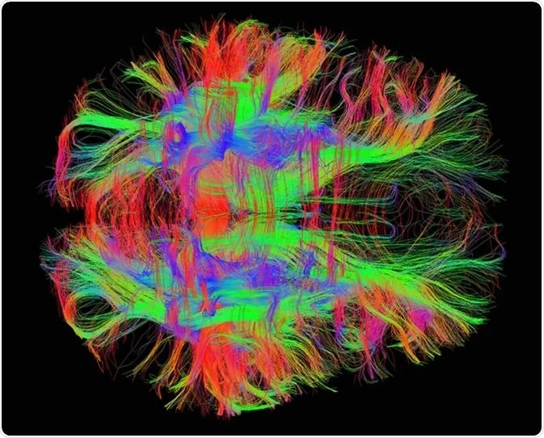

#core/appliedneuroscience 

Diffusion tensor tractography **uses DTI data to map white matter tracts in the brain.** It estimates the trajectory and connectivity patterns of neural fibres by measuring water diffusion along them.

## Applications

Tractography provides valuable information about:
- Brain regions' structural connectivity and organisation.
- Neural pathways' integrity and function.
- Diagnosing and monitoring conditions such as:
	- White matter damage
	- Demyelination disorders
	- Traumatic brain injury
	- Neurodegenerative diseases