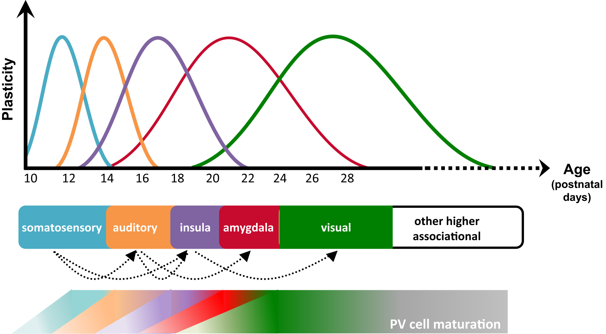

#core/appliedneuroscience

Hebbian plasticity is a theory about [synaptic plasticity](Synaptic%20plasticity.md) proposed by [Donald Hebb](https://en.wikipedia.org/wiki/Donald_O._Hebb) in 1949. It’s often summarised as **“Cells that fire together, wire together.”** This implies that the connections between neurons that fire at the same time become stronger.

## Key Features

- **Hebbian Learning:** This is a rule for adjusting weights on connections in artificial neural networks, and it’s based on how neurons adapt during the process of Hebbian plasticity. If two connected neurons fire simultaneously, their synaptic connection is strengthened.
- **Example:** A real-world example of Hebbian plasticity is seen in sensory deprivation studies. For instance, in kittens, if one eye is covered during a critical period of development, the synapses in the visual cortex that receive input from that eye will weaken, while the synapses receiving input from the other eye will strengthen. This is an example of “fire together, wire together.”

## Critical Period

A critical period is a specific time in development when certain skills or abilities are most easily learned. During this time, the developing organism is particularly sensitive to certain environmental stimuli.

### Key Features

- **Critical Period in Human Language Acquisition:** The most famous example of a critical period in human development is language acquisition. Research suggests that if a child doesn’t learn a language before a certain age (often said to be around puberty), they will never fully acquire the complete grammar and pronunciation of a native speaker.
- **Critical Period in Vision Development:** Another common example is the development of vision. Certain visual experiences (like perceiving light, shapes, and movement) must occur during the critical period for the visual system to develop properly.
