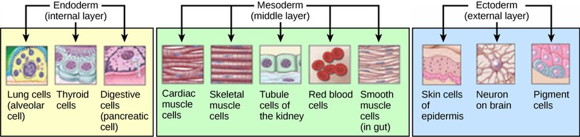

#core/appliedneuroscience

Histogenesis is the **process of the formation and development of different types of tissues from embryonic cells.** This process occurs during embryonic development, guiding cells into differentiating into the various types of tissues that make up an organism’s body.

## Germ Layers

The three primary germ layers give rise to distinct tissue types:

- **Ectoderm** → nervous system, skin, pigment cells
- **Mesoderm** → muscle, blood, kidney
- **Endoderm** → digestive and respiratory linings, glands

Neural tissue derives from the ectoderm, through the processes of [Neurulation](Neurulation.md) and [Neurogenesis](Neurogenesis.md).

## Stages of Histogenesis

1. **Proliferation**: Cells divide and multiply.
2. **Migration**: Cells move to their appropriate locations. See [Neuronal migration](Neuronal%20migration.md).
3. **Differentiation**: Cells take on specific characteristics and functions.
4. **Death** (also known as [apoptosis](../08%20Advances%20in%20Neuroscience/Apoptosis.md)): Some cells die to shape the final structure of the tissue or organ.
