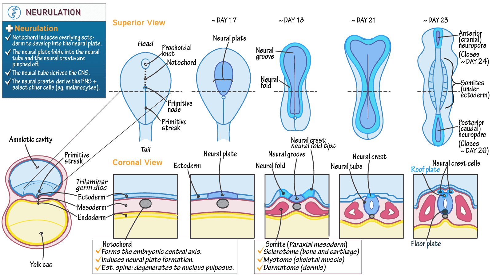

#core/appliedneuroscience 

Neurulation is the **process during embryonic development in which the neural tube is formed.** The neural tube is the precursor to the [central nervous system](Central%20nervous%20system.md), including the brain and spinal cord. Neurulation involves the folding and fusing a flat sheet of ectodermal cells, known as the neural plate, into a hollow tube structure. This process is critical for the proper development of the nervous system in vertebrate embryos.

> [!note]  More info
> - Primary vs secondary neurulation: cranial–lumbar tube forms by folding and fusion (primary); most caudal cord forms by cavitation of a solid cell mass (secondary).
> - Key timeline (human): neural plate day 18; groove day 19–20; closure starts ~day 22; cranial neuropore closes ~day 24–25; caudal neuropore ~day 26–28.
> - Neural crest: cells delaminate from the dorsal neural tube to form much of the peripheral nervous system, melanocytes, and craniofacial structures.
> - Patterning cues: Shh from notochord/floor plate ventralises; BMP/Wnt from ectoderm/roof plate dorsalises the tube.
> - Closure failures → neural tube defects: anencephaly (rostral) and spina bifida (caudal). Periconceptional folic acid (400 μg/day) markedly reduces risk.
> - Risk modifiers: maternal diabetes, folate antagonists (e.g., valproate, methotrexate), and hyperthermia increase NTD risk.