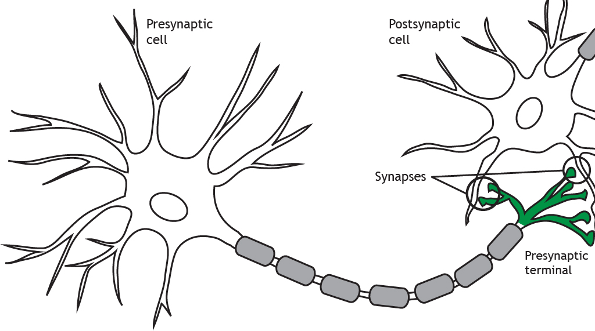

#core/appliedneuroscience 

 

- **Pre-synaptic neurons** are neurons that transmit signals towards a synapse, where communication occurs with another neuron or a target cell. They release neurotransmitters into the synapse.

- **Post-synaptic neurons** are neurons that receive signals at a synapse from pre-synaptic neurons. They contain receptors that bind to the neurotransmitters released by pre-synaptic neurons, triggering electrical or chemical signals within the post-synaptic neuron.