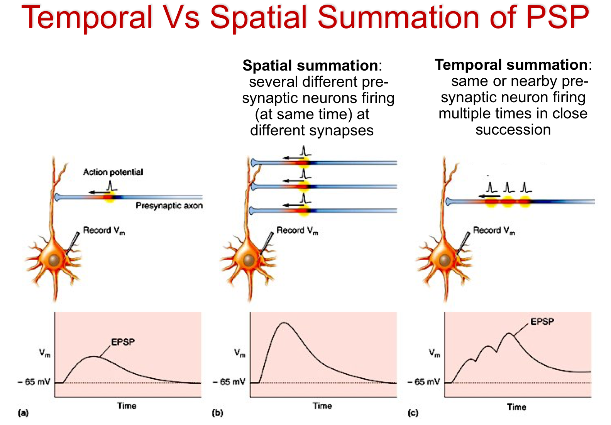

#core/appliedneuroscience 

Summation refers to the **process by which neurons integrate input signals.** [Graded potential](Graded%20potential.md)s from different parts of the neuron's body are added together to determine whether the neuron will fire an action potential. There are two types of summation: spatial and temporal.

## Spatial Summation

Spatial summation occurs when graded potentials from multiple locations on the neuron's body are combined.

- It refers to the addition of simultaneous inputs from different locations on the dendrites and cell body of the neuron.
- Inputs from multiple presynaptic neurons can be integrated at the same time to alter the membrane potential significantly.
- If the combined effect of these simultaneous inputs is sufficient to reach the threshold potential, an action potential will be generated.

## Temporal Summation

Temporal summation occurs when a single presynaptic neuron fires action potentials so rapidly that the effects of each individual [graded potential](Graded%20potential.md) are combined.

- It refers to the addition of successive inputs from the same location on the dendrites and cell body over a short period of time.
- A single presynaptic neuron can thus influence whether the postsynaptic neuron reaches the threshold potential.
- If the combined effect of these successive inputs is sufficient to reach the threshold potential, an action potential will be generated.