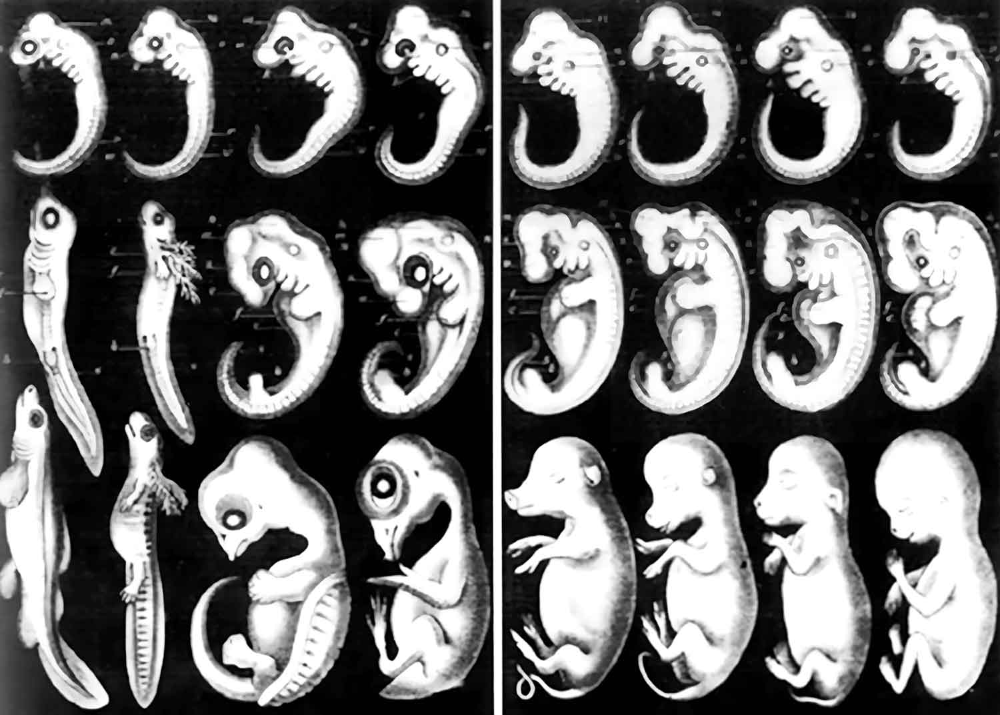

#core/appliedneuroscience

The tailbud stage is a **developmental stage during vertebrate embryogenesis, specifically during the early stages of organogenesis.** It is characterised by the formation of the tail bud, which is a swelling at the embryo's caudal (tail) end. The tailbud stage is important for the subsequent growth and development of the tail and other structures derived from the embryonic mesoderm.
