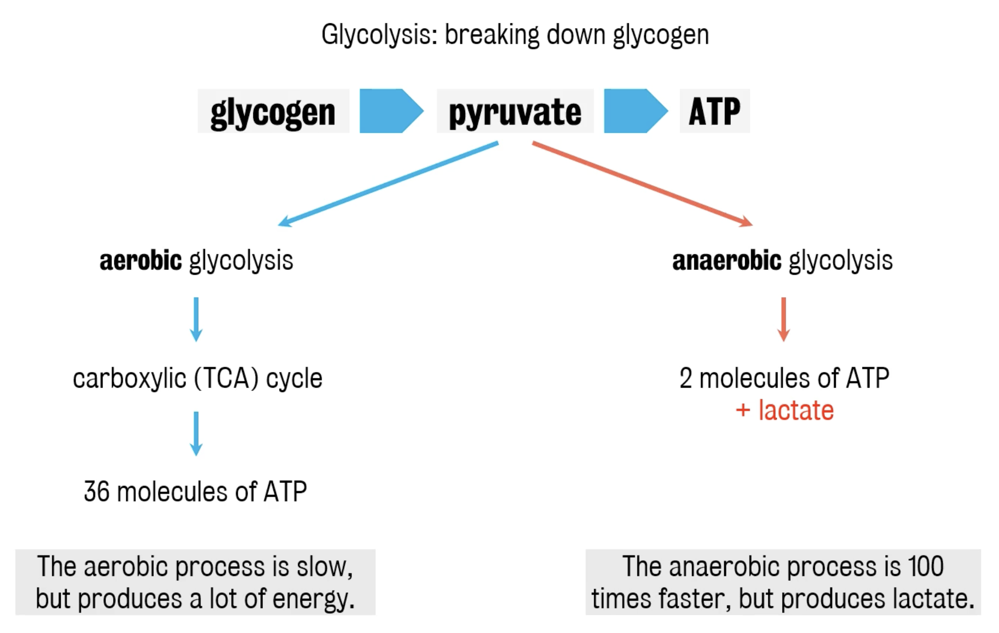

#core/appliedneuroscience

## Introduction

The brain is a highly energy-**demanding organ, relying primarily on glucose metabolism.** It can utilise two pathways for glucose metabolism: aerobic glycolysis and anaerobic glycolysis, each leading to the production of different [Metabolites](../../../002_profession/eightsix%20science/Metabolites.md), including lactate.

## Aerobic Glycolysis

- **Definition**: Aerobic glycolysis is the process of breaking down glucose in the presence of oxygen.
- **Location**: Takes place in the cytoplasm and mitochondria.
- **Process**:
  - Glucose is converted into pyruvate through a series of enzymatic reactions.
  - Pyruvate enters the mitochondria and is further processed in the TCA cycle and oxidative phosphorylation, leading to the production of ATP.
- **Energy Yield**: Produces a significant amount of ATP (36 ATP molecules per glucose).
- **Role in the Brain**:
  - Predominant under normal physiological conditions.
  - Supports various brain functions, including neurotransmitter synthesis.

## Anaerobic Glycolysis

- **Definition**: Anaerobic glycolysis is the process of metabolising glucose without oxygen.
- **Location**: Occurs in the cytoplasm.
- **Process**:
  - Glucose is broken down into pyruvate, which is then converted into lactate when oxygen is limited.
  - The conversion of pyruvate to lactate regenerates NAD+, crucial for continuous glycolysis.
- **Energy Yield**: Produces a minimal amount of ATP (2 ATP molecules per glucose).
- **Role in the Brain**:
  - Occurs during conditions of high energy demand or low oxygen supply.
  - Lactate produced can be utilised as an energy source by neurons.
