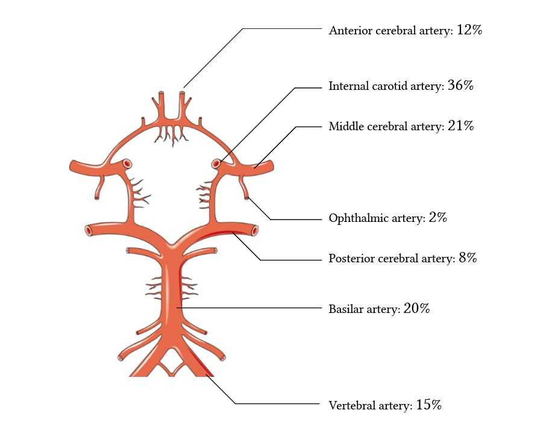

#core/appliedneuroscience

Cerebral Blood Flow (CBF) is the **blood supply to the brain in a given time.** It’s crucial for delivering nutrients and oxygen while removing waste products. **Unlike other parts of the body, the brain has unique regulatory mechanisms to ensure a constant flow despite changes in systemic blood pressure or metabolic demand.**

## Characteristics

- **Magnitude:** The human brain, while only about 2% of body weight, consumes approximately 20% of the body’s oxygen and glucose, necessitating a high blood flow rate.
- **Autoregulation:** CBF is autoregulated, meaning it maintains a relatively constant flow despite changes in systemic arterial pressure. This is crucial for protecting the brain from hypoperfusion and hyperperfusion.

## Regulation Mechanisms

- **Metabolic Regulation:** CBF changes in response to neuronal activity. Increased neuronal activity leads to increased metabolism, which in turn increases CBF. This is primarily mediated by the local concentration of [metabolites](../../../002_profession/eightsix%20science/Metabolites.md) like CO2 and H+ ions.
- **Myogenic Response:** The smooth muscles in cerebral blood vessels contract or relax in response to changes in blood pressure to maintain a constant flow.
- **Neurogenic Regulation:** Neural factors influence CBF, including various neurotransmitters and neuropeptides from perivascular nerves.
- **Endothelial Factors:** The endothelial chamber of cerebral vessels releases substances like nitric oxide and endothelins that affect vascular tone and blood flow.

## Differences from Other Body Parts

- **BBB Influence:** The cerebral vessels’ unique structure and the presence of the [Blood-brain barrier](Blood-brain%20barrier.md) affect the permeability and regulatory mechanisms distinctly from other body tissues.
- **Sensitivity:** The brain is highly sensitive to ischemia. Even short periods of reduced blood flow can lead to significant neuronal damage, making tight regulation of CBF critical.
- **Flow-Metabolism [Coupling](Neurovascular%20coupling.md):** The brain has a higher degree of coupling between flow and metabolism than other organs, reflecting its high and variable metabolic demand.
