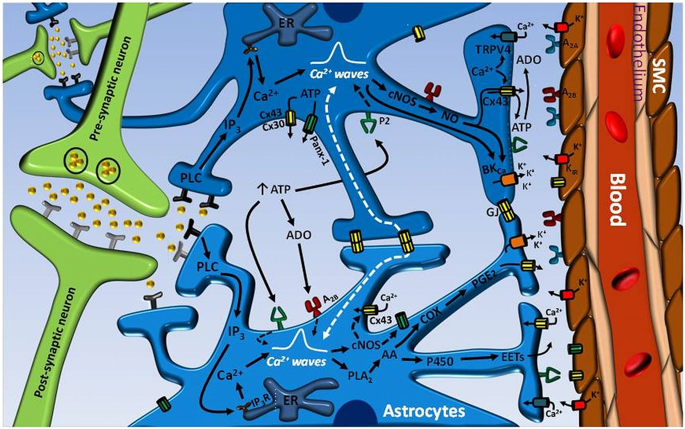

#core/appliedneuroscience

Neurovascular coupling (NVC) is the mechanism by which **[Cerebral blood flow](Cerebral%20blood%20flow.md) is regulated in response to neural activity.** This process is critical in the brain, which has high energy demands but lacks significant energy reserves.

## Energy Demands of the Brain

- **High Metabolic Rate**: The brain, although only a small fraction of the body’s weight, consumes a disproportionately large amount of the body’s energy.
- **Lack of Energy Reserves**: The brain does not store energy unlike other organs. It relies on a continuous supply of oxygen and glucose from the bloodstream.
- [Aerobic](Aerobic%20and%20anaerobic%20glycolysis.md#aerobic-glycolysis) Glycolysis**: The brain primarily uses aerobic glycolysis for energy production. This process requires a steady supply of oxygen and glucose, making the regulation of blood flow crucial.

## Mechanism of NVC

- **Response to Neural Activity**: When a region of the brain becomes active, it consumes more energy, leading to an increase in local blood flow. This ensures an adequate supply of oxygen and nutrients.
- **Role of Neurons and Glial Cells**: Neuronal activity triggers the release of vasoactive substances, which cause nearby blood vessels to dilate. Glial cells, particularly astrocytes, also play a role in signalling to blood vessels.

## Importance

- **Functional Brain Imaging**: Techniques like fMRI rely on NVC to detect brain activity by measuring changes in blood flow.
- **Neurological Health**: Proper NVC is essential for brain health. Dysregulation can contribute to neurological diseases like stroke and Alzheimer’s disease.
