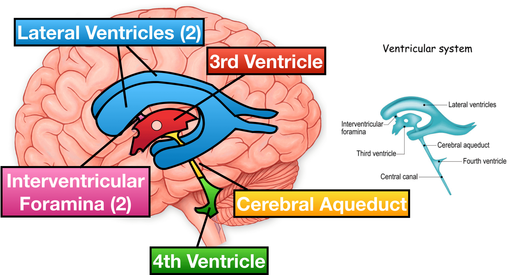

#core/appliedneuroscience

The ventricular system is a set of **four interconnected cavities in the brain.** It is filled with cerebrospinal fluid (CSF); it cushions the brain and removes waste. The system consists of two lateral ventricles, the third ventricle and the fourth ventricle.

## Lateral Ventricles

- **Location**: Each hemisphere of the brain houses one lateral ventricle.
- **Structure**: C-shaped chambers divided into frontal (anterior), occipital (posterior), and temporal (inferior) horns.
- **Function**: Produce a large amount of CSF.

## Third Ventricle

- **Location**: Situated in the midline, between the two halves of the thalamus.
- **Connection**: Interconnected with lateral ventricles via the interventricular foramina (foramina of Monro).
- **Function**: Acts as a conduit for CSF to flow into the fourth ventricle.

## Fourth Ventricle

- **Location**: Located between the brainstem and the cerebellum.
- [Connections](../04%20Biological%20Foundations%20of%20Mental%20Health/Cortical%20connections.md)**: CSF flows into the subarachnoid space via the median aperture (foramen of Magendie) and lateral apertures (foramina of Luschka).
- **Function**: Continues CSF circulation towards the spinal cord.

## Cerebrospinal Fluid (CSF)

- **Production**: Mainly by the choroid plexus in the ventricles.
- **Function**: Cushions the brain, removes metabolic waste and provides an optimal chemical environment.
- **Circulation [Pathway](../01%20Techniques%20in%20Neuroscience/Indirect%20and%20direct%20neural%20pathways.md)**: From the lateral ventricles → third ventricle → fourth ventricle → subarachnoid space surrounding the brain and spinal cord.

## Clinical Significance

- **Hydrocephalus**: A condition where excess CSF accumulates, often due to blockage in the ventricular system.
- **Diagnosis**: Conditions like hydrocephalus are often diagnosed using imaging techniques like MRI or CT scans.
