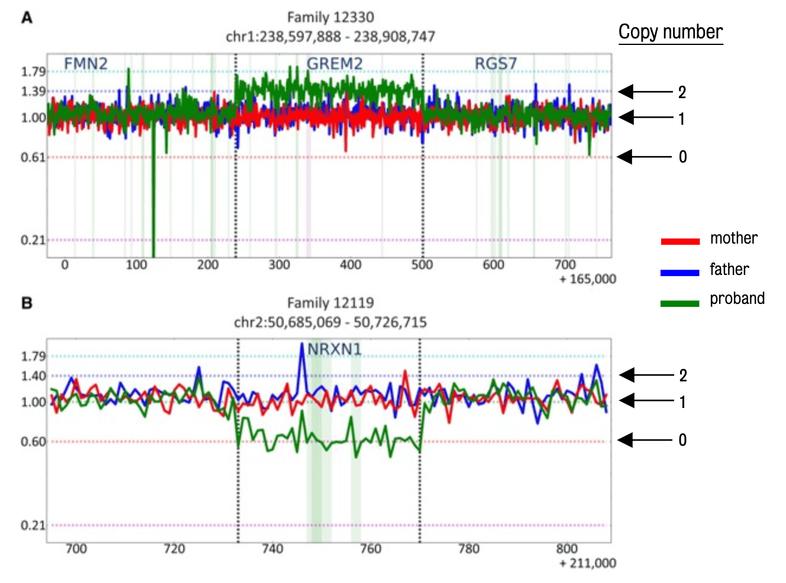

#core/appliedneuroscience

## Balanced Chromosomal Changes

Balanced chromosomal changes occur **when genetic material is not gained or lost but is rearranged.** These rearrangements can happen in several ways, including translocations, where segments of chromosomes are swapped between two chromosomes, and inversions, where a chromosome segment is reversed end to end. Individuals with balanced chromosomal changes are often phenotypically normal because all genetic material is present, but they can have reproductive issues or produce offspring with unbalanced chromosomal changes due to abnormal segregation during meiosis.

### Key Points

- No gain or loss of genetic material.
- Includes translocations and inversions.
- Individuals may be phenotypically normal.
- It can lead to reproductive issues.

---

## Unbalanced Chromosomal Changes

Unbalanced chromosomal changes **involve a gain or loss of genetic material, leading to partial trisomies (extra copies of a chromosome segment) or monosomies (missing segments).** These changes can result from deletions, where a chromosome segment is missing, or duplications, where extra copies of a segment are present. Unbalanced changes often result in developmental and physical abnormalities, intellectual disabilities, and health problems, depending on the size and location of the affected chromosomal segments.

### Key Points

- Involves gain or loss of genetic material.
- Includes deletions and duplications.
- Often leads to developmental, physical, and intellectual abnormalities.
- Severity depends on the affected chromosomal segments.
