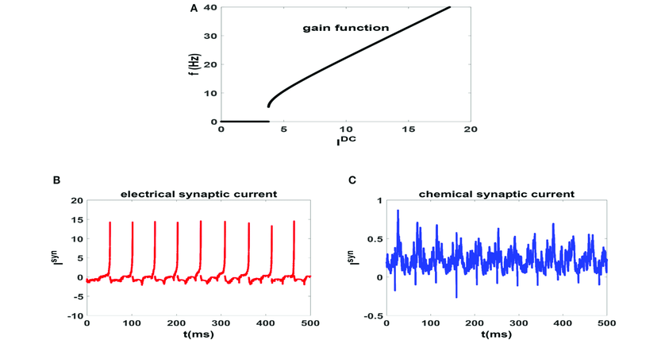

#core/appliedneuroscience

[Synaptic](../04%20Biological%20Foundations%20of%20Mental%20Health/Synaptic%20plasticity.md) gain refers to the **strength or efficacy of a synapse in transmitting signals from one neuron to another.** This concept is crucial because it influences how easily and to what extent a neuron can influence the activity of another neuron. Synaptic gain is determined by various factors, including:

1. **Neurotransmitter [Release](../04%20Biological%20Foundations%20of%20Mental%20Health/Exocytosis.md#key-points-in-neurotransmitter-release):** The amount and type of neurotransmitter released into the synaptic cleft can affect synaptic gain. Higher amounts of neurotransmitter release typically increase synaptic gain.
2. **Receptor Sensitivity:** The sensitivity of the receptors on the postsynaptic neuron to the neurotransmitter also plays a role. Higher sensitivity usually leads to increased synaptic gain.
3. [Synapse](../04%20Biological%20Foundations%20of%20Mental%20Health/Types%20of%20synapses.md) Structure:** The physical structure of the synapse, such as the synaptic cleft’s size and the receptors’ density, can influence synaptic gain.
4. **Modulatory Inputs:** Other neurons can modulate synaptic gain through various mechanisms, such as releasing neuromodulators that affect the release of neurotransmitters or the sensitivity of receptors.
5. **Plasticity [Mechanisms](../04%20Biological%20Foundations%20of%20Mental%20Health/Neuron%20transport%20mechanisms.md):** [Long-term](../../../001_private/books/Augmenting%20Cognition/Activity-dependent%20plasticity.md#long-term-potentiation-ltp) changes in synaptic strength, such as long-term potentiation (LTP) or long-term depression (LTD), can lead to sustained increases or decreases in synaptic gain. These changes are often associated with learning and memory.
