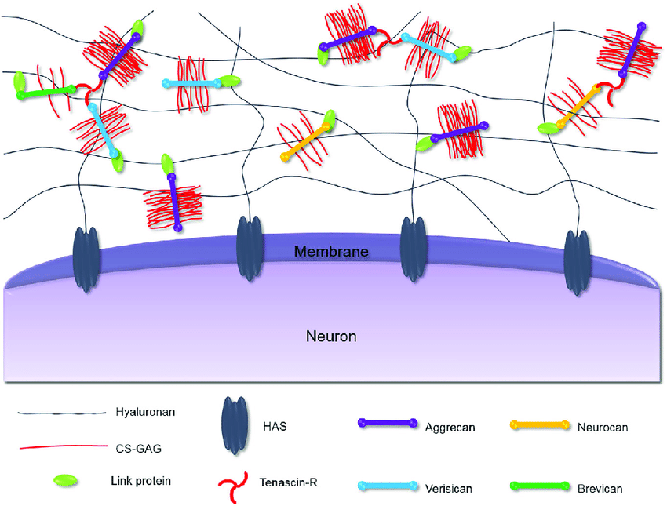

#core/appliedneuroscience

Brevican is a **brain-specific chondroitin sulfate proteoglycan found in the extracellular matrix** (ECM) of the [central nervous system](../04%20Biological%20Foundations%20of%20Mental%20Health/Central%20nervous%20system.md). It is a member of the lectican family, which also includes aggrecan, versican, and neurocan. The presence of brevican in the ECM is **significant for maintaining neural structure and modulating functions** related to neuroplasticity.

## Structure of Brevican

The molecular structure of brevican includes a core protein with one or more chondroitin sulfate glycosaminoglycan (CS-GAG) chains. This arrangement allows it to interact with other ECM components such as hyaluronan, link proteins, and tenascin-R, as depicted in the provided figure. These interactions are crucial for maintaining the integrity and biophysical properties of the neural ECM.

## Role in Neuroplasticity

Brevican contributes to neuroplasticity—a fundamental property of the brain involving the reorganisation of neural connections—in several ways:

### 1. [Synaptic](../04%20Biological%20Foundations%20of%20Mental%20Health/Synaptic%20plasticity.md) Function

Brevican helps to stabilise and regulate synapses, ensuring the appropriate balance of synaptic activity. Its interactions with other ECM proteins influence the strength and plasticity of synaptic connections.

### 2. [Neuronal](../01%20Techniques%20in%20Neuroscience/Neuronal%20cell%20types.md) Structure

It is implicated in controlling the ECM’s stiffness and porosity, which affects the outgrowth of neurites. Thus, brevican indirectly influences the physical architecture of neuronal networks.

### 3. Response to Injury

As illustrated in the attached figure, brevican is one of the ECM components that are upregulated in response to neuronal injury. This suggests its involvement in the repair and regenerative processes in the brain.

## Brevican and ECM Complexity

The attached figure also illustrates the complex nature of the ECM in the neuronal environment, where brevican, along with hyaluronan, link proteins, and other lecticans, creates a network that regulates cellular processes essential for brain function. The interactions between these molecules are crucial for maintaining the delicate balance necessary for neural plasticity and repair.
