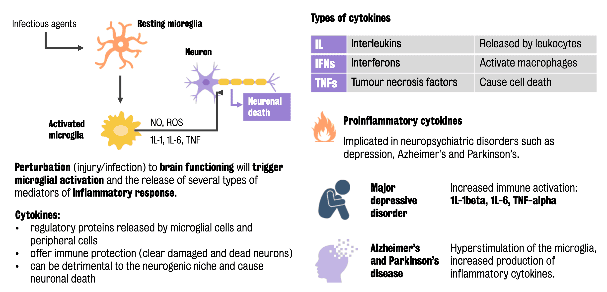

#core/appliedneuroscience

Cytokines are **small proteins that have a significant impact on communication between cells.** They are particularly crucial in the body’s immune response. In the nervous system, cytokines play a role in neuroinflammation, which can lead to neuronal cell death.

## Role of Cytokines in the Brain

- **Regulation:** Cytokines are regulatory proteins released by microglial cells and peripheral cells.
- **Immune Protection:** Their primary role is to offer immune protection by clearing damaged and dead neurons, thus maintaining homeostasis in the brain.
- **Dual Effect:** While cytokines provide protective roles, they can also be detrimental to the [neurogenic niche](Neurogenic%20niche.md) and cause neuronal death when overexpressed or dysregulated.

## Cytokines in Disease

- **Proinflammatory Cytokines:** These are implicated in neuropsychiatric disorders such as major depressive disorder, Alzheimer’s, and Parkinson’s disease.
- **Overactivation:** Hyperstimulation of microglia and the subsequent overproduction of inflammatory cytokines like IL-1beta, IL-6, and TNF-alpha can lead to increased neuronal death.
