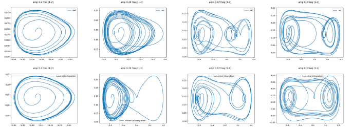
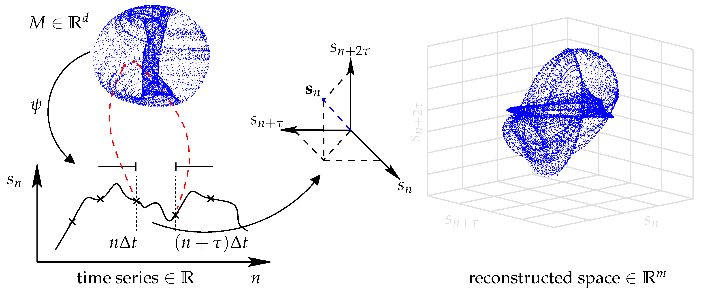

#core/appliedneuroscience #core/artificialintelligence

Phase space and phasing rotators are **critical tools in neural signal processing**, offering insights into neural signals’ dynamic behaviour and manipulation.

## Phase [Space](../../../001_private/videos/Latent%20space.md)

- **Definition**: Represents all possible states of a system.
- **Applications**:
  - **Visualisation**: Helps visualise neural signal dynamics.
  - **State [Analysis](../06%20Neuroimaging%20in%20Mental%20Health/Spectral%20analysis%20in%20EEG.md)**: Identifies patterns like stable points or chaotic behaviours in neural systems.

## Phasing Rotator

- **Definition**: Alters the phase of a signal without changing its amplitude.
- **Applications**:
  - **Signal Alignment**: Aligns signals from different channels in multi-channel neural recordings.
  - **Phase Manipulation**: Probes the importance of phase relationships in neural coding.

## Integration in Neural Analysis

Combining phase space analysis with phasing rotators allows for modelling how phase adjustments impact neural dynamics, enhancing techniques like phase locking value (PLV) and phase-amplitude coupling (PAC).
