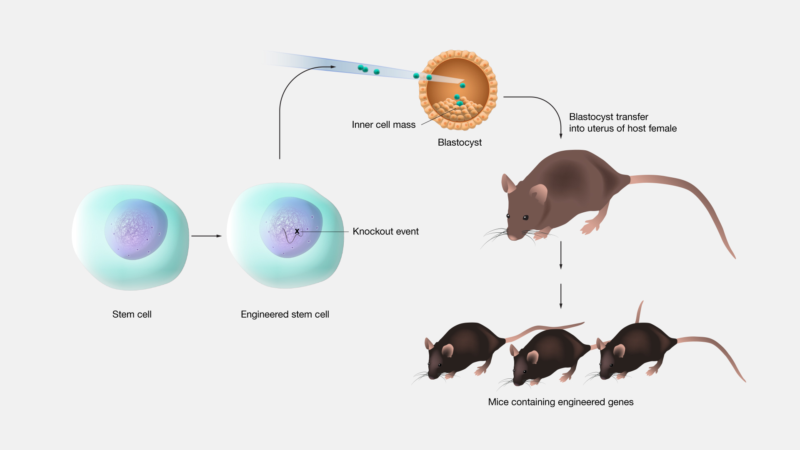

#core/appliedneuroscience

A genetic knockout allows researchers to **study the function of specific genes by observing what happens when they are disabled.**

## Methods

### Homologous Recombination

Traditional method using embryonic stem cells. A targeting vector with mutated sequence is introduced, and through natural DNA repair mechanisms, the vector replaces the endogenous gene. Selection markers (e.g., neomycin resistance) enable isolation of correctly targeted cells. This method is precise but time-consuming.

### CRISPR-Cas9

More recent and efficient approach using RNA-guided endonucleases. A guide RNA directs Cas9 to specific genomic loci, creating double-strand breaks that are repaired via non-homologous end joining (NHEJ) or homology-directed repair (HDR). CRISPR enables faster generation of knockouts and knock-ins compared to homologous recombination.

## Applications in Neuroscience

- **Brain development**: Identifying genes critical for [neurogenesis](../04%20Biological%20Foundations%20of%20Mental%20Health/Neurogenesis.md), migration, and synapse formation
- **Neuropsychiatric disorders**: Modelling genes associated with schizophrenia, autism, and depression in animal models
- **Neurodegeneration**: Studying genes involved in Alzheimer's, Parkinson's, and Huntington's disease
- **Behavioural studies**: Linking specific gene expression to cognitive function, memory, and social behaviour

## Limitations

- **Compensatory mechanisms**: Organisms may upregulate related genes or pathways to compensate for the loss, masking the true function of the knocked-out gene
- **Lethality**: Knockout of essential genes can be embryonic lethal or cause severe phenotypes, limiting study to conditional systems
- **Off-target effects**: Particularly relevant for CRISPR, where unintended edits can confound results
- **Developmental compensation**: If the gene is knocked out throughout development, phenotypes may reflect adaptive responses rather than the gene's primary role

## Conditional Knockouts

To address limitations, researchers use **conditional knockouts** (e.g., Cre-loxP system) to:
- Target specific tissues (brain, cortex, hippocampus)
- Induce knockout at specific developmental stages
- Avoid embryonic lethality by timing the gene removal

This allows study of gene function in adult animals or specific neural circuits.
