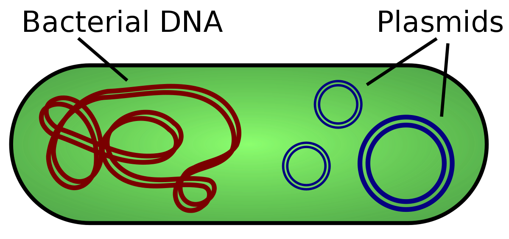

#core/appliedneuroscience

**Plasmids** are small, circular, double-stranded DNA molecules found in bacteria and some eukaryotes. They replicate independently of chromosomal DNA and are not essential for survival but often confer selective advantages (e.g., antibiotic resistance). In neuroscience, plasmids serve as fundamental tools for gene delivery, enabling expression of fluorescent reporters, optogenetic actuators, and therapeutic transgenes.

## Structure and Key Components

| Element | Function |
|---------|----------|
| **Origin of replication (ori)** | Enables autonomous replication; determines copy number |
| **Selectable marker** | Usually antibiotic resistance gene (e.g., ampicillin, kanamycin) for bacterial selection |
| **Promoter** | Drives transgene expression; choice depends on target (CMV for broad expression, CaMKII for excitatory neurons, GFAP for astrocytes) |
| **Multiple cloning site (MCS)** | Region with unique restriction enzyme sites for inserting genes of interest |
| **Polyadenylation signal** | Ensures proper mRNA processing and stability |

## Applications in Neuroscience

### Gene Expression Studies

Plasmids enable transient or stable expression of proteins in neural cells. Common uses include:
- **Fluorescent reporters** (GFP, mCherry) for cell labelling and lineage tracing
- **Calcium indicators** (GCaMP) for activity imaging
- **Voltage indicators** for membrane potential recording

### Optogenetics

Plasmids deliver light-sensitive opsins to specific neural populations:
- **Channelrhodopsin-2 (ChR2)** — excitatory, depolarises neurons with blue light
- **Halorhodopsin (NpHR)** — inhibitory, hyperpolarises with yellow light
- **Archaerhodopsin** — inhibitory proton pump

### Viral Vector Production

Plasmids are essential for producing viral vectors:
- **AAV plasmids** contain inverted terminal repeats (ITRs) flanking the transgene
- **Lentiviral plasmids** include packaging sequences for integration into host genome
- Co-transfection of transfer, packaging, and envelope plasmids generates viral particles

### CRISPR-Cas9 Delivery

Plasmids can encode:
- Cas9 nuclease or variants (dCas9, Cas9n)
- Guide RNAs (sgRNAs) targeting specific genomic loci
- Donor templates for homology-directed repair

## Delivery Methods

| Method | Mechanism | Use Case |
|--------|-----------|----------|
| **Lipofection** | Cationic lipids form complexes with DNA | In vitro cell culture |
| **Electroporation** | Electric pulses create transient membrane pores | In utero, slice cultures |
| **Calcium phosphate** | DNA-calcium precipitate enters via endocytosis | Primary neuronal cultures |
| **Microinjection** | Direct injection into cells/embryos | Single-cell precision |
| **In utero electroporation** | Targets embryonic neural progenitors | Cortical development studies |

## Considerations for Neuroscience Use

> [!tip] Promoter Selection
> Cell-type specificity depends heavily on promoter choice. Synapsin (Syn) targets neurons broadly, while Dlx enhancers restrict expression to GABAergic interneurons.

- **Expression level**: Strong promoters (CMV, CAG) may cause toxicity; weaker promoters often preferable for long-term studies
- **Temporal control**: Inducible systems (Tet-On/Off, Cre-loxP) allow temporal regulation
- **Size constraints**: Large transgenes may reduce transfection efficiency; consider using minimal promoters or splitting constructs

## Related Concepts

- [Optogenetics](../../../001_private/social-media/linkedin/Optogenetics.md)
