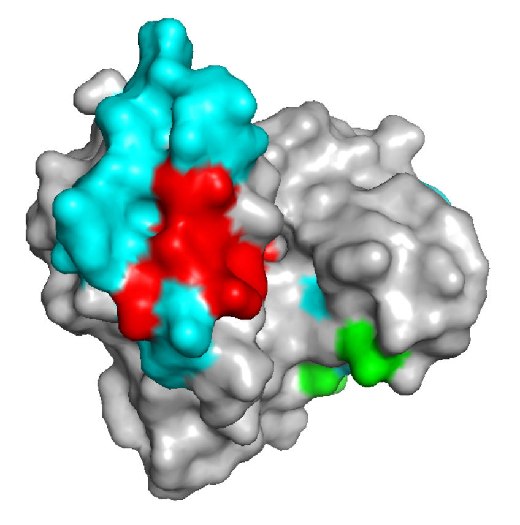

#core/appliedneuroscience

An epitope is a **specific portion of a molecule, usually a protein or a carbohydrate, that is recognised and bound by an antibody or a T cell receptor.** A 3D epitope refers to the three-dimensional structure of the epitope, which is the spatial arrangement of the atoms that compose it.

Epitopes can be **linear** (sequential amino acid residues) or **conformational** (formed by folding into a specific 3D shape). This distinction matters for antibody-based brain imaging: conformational epitopes are sensitive to fixation and processing methods, affecting reliability of immunohistochemical staining in neural tissue.

> [!warning] Experimental consideration
> Conformational epitopes are sensitive to fixation protocols — paraformaldehyde vs methanol can alter antibody binding in immunohistochemical staining.
